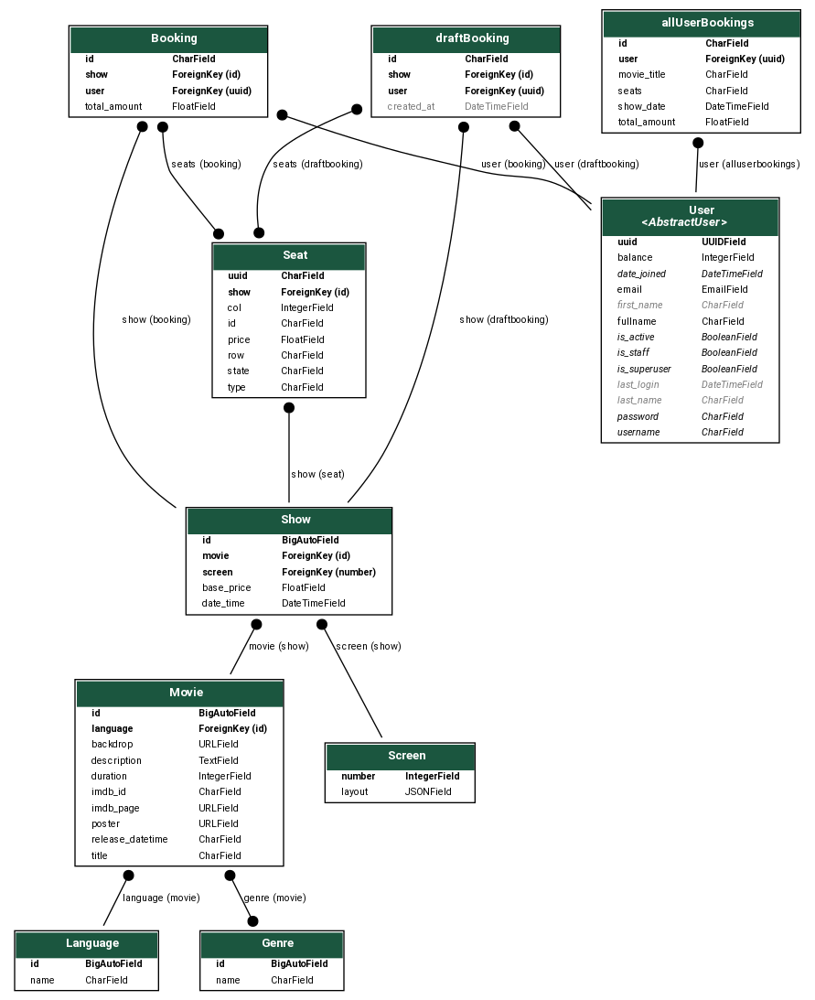
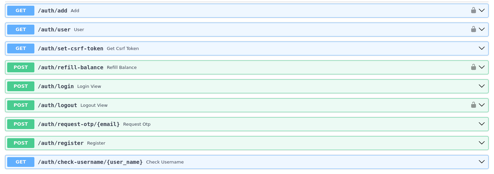
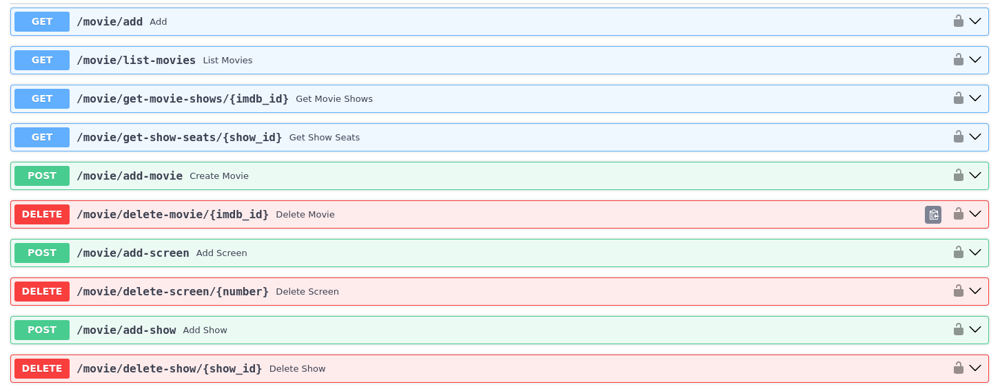
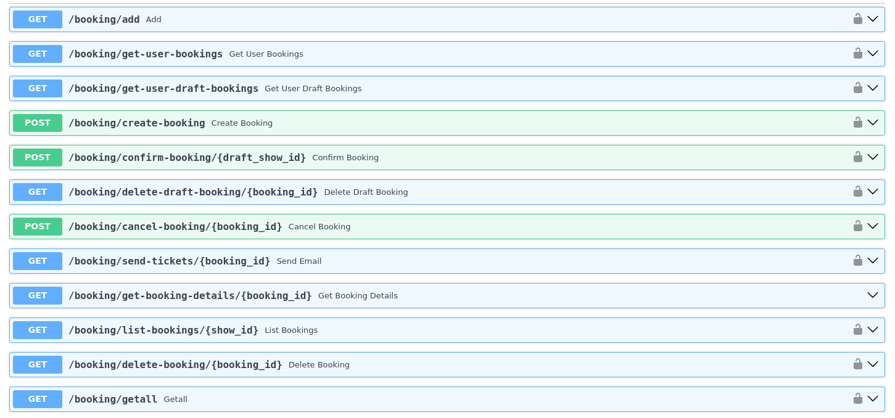
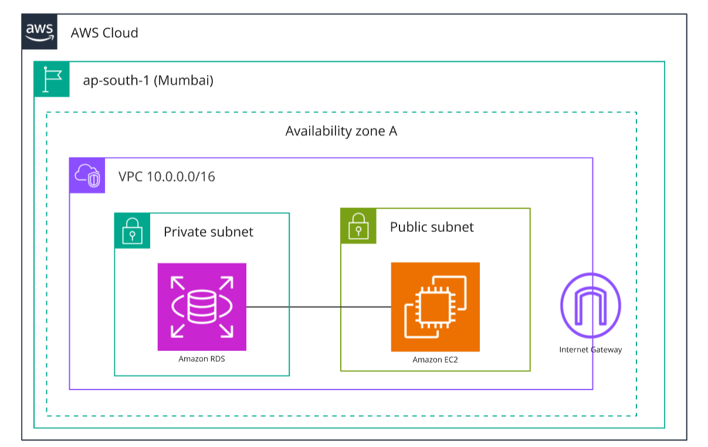

# Filmsphere

- FilmSphere is an open-source, educational project inspired by roadmap.sh, allowing users to browse movies, book virtual show tickets using a coin-based system, and interact with features like an interactive seating layout and booking history.


- Motivation - https://roadmap.sh/projects/movie-reservation-system
- Sibling project - https://github.com/filmsphere/frontend/

---
## Features 

- **Seat Reservation System** with real-time seat availability and selection.
- **Booking Management** to prevent overbooking and manage reservations efficiently.
- **QR Code Tickets & Email Notifications** for confirmed bookings.
- **Auto Cleanup** for expired showtimes and pending bookings.
- **Complete Movie, Seat, Show, and Booking Management** for admins.
- **User Authentication & Role-Based Authorization** with admin and regular user roles.
- **Virtual Coins System** for payments and refunds.

---

## Database design
- Generated using django-extensions



---

## API Design
- `/auth`


- `/movie`


- `/booking`


---

## Cloud Architecture [AWS]
- Tried to fit everything under the AWS Free trial



---

## Installation -

#### Requirements

1. `python3` >= 3.10
2. `postgres`

#### Steps -

1. pull the repo

```bash
git clone https://github.com/filmsphere/backend.git
```

2. Install rav

```bash
pip install rav
```

3. activate environment & install packages

```bash
rav run install
```

4. Create `.env` in reflection of `.env.example` and add required keys 

5. Migration

```bash
python3 manage.py migrate
```

6. start the developmet server

```bash
rav run dev
```

> [!NOTE]  
> `crontab` functionalities are supported only on UNIX-based operating systems. For Windows environments, consider using Windows Task Scheduler or alternative scheduling tools that provide similar functionalities.
